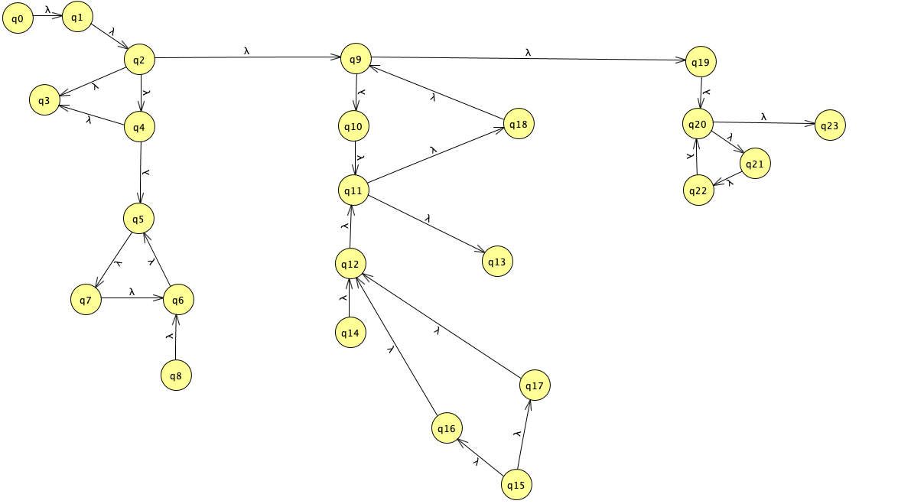
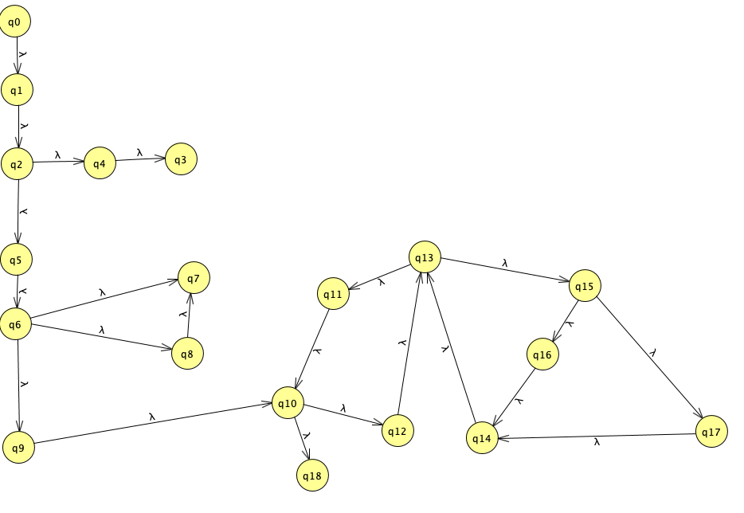

# Teste funcional: Particionamento em classes de equivalência

No método `main` temos varias funções chamadas da classes `Processador`, então para cada chamada foi feito os testes funcional de formas separadas, que resultou em conjuntos de teste valido e inválidos.

As funções estão representadas logo abaixo.

- problemaMochilaForcaBrutaGulosa
- problemaMochilaDinamico

## `problemaMochilaForcaBrutaGulosa`

Este método é classificado como uma função que retorna `void` ou seja não se retorna nada, para se chamar essa função ela faz uso de três parâmetros, um array de `Item`, e um `int` `n` que não é usado no escopo da função em nenhum momento, também temos um `int` `c` que representa a capacidade da mochila.

A estratégia para criar as classes de equivalência, sera variar o número de itens e os valores de cada parâmetro da função, mas vamos ignorar o parâmetro `n` ja que a mesma não faz uso desta variável.

### Partições

- Validas de c: c > 0
- Validas de itens: array.length > 0
- Invalidas de c: c <= 0
- Invalidas de itens: array.length == 0 | array == null

### Classes

| Classe | Capacidade | Itens |
|:------:|:----------:|:-----:|
| 1 | c > 0 | `array.length` > 0 |
| 2 | c > 0 | `array.length` == 0 |
| 3 | c > 0 | `array` == null |
| 4 | c <= 0 | `array.length` > 0 |
| 5 | c <= 0 | `array.length` == 0 |
| 6 | c <= 0 | `array` == null |

### Casos de teste

| Identificador | Argumentos (x, itens) | Sáida Esperada | Nós |
|:-------------:|:---------------------:|:--------------:|:---:|
| CT1 | 7, [(5,2),(2,4),(2,2),(1,3)] | 9 | 1 |
| CT2 | 5, [] | ERROR | 2 |
| CT3 | 5, null | ERROR | 3 |
| CT4 | -1, [(5,2),(2,4),(2,2),(1,3)] | ERROR | 4 |
| CT5 | -1, [] | ERROR | 5 |
| CT6 | -1, null | ERROR | 6 |

### Execução dos testes

| C. Teste | Saída |
|:--------:|:-----:|
| CT1 | 9 |
| CT2 | 0 |
| CT3 | ERROR |
| CT4 | ERROR |
| CT5 | ERROR |
| CT6 | ERROR |

----

## `problemaMochilaDinamico`

Este método compartilha a mesma interface de chamada do método anterior, assim ele compartilha os mesmos parâmetros e os mesmos retornos, mas na implementação deste, ele faz uso do nosso parâmetro `n`.

Assim para a criação das classes sera feita a adição do mesmo.

### Partições

- Validas de c: c > 0
- Validas de itens: array.length > 0
- Validas de n: n >= 0
- Invalidas de c: c <= 0
- Invalidas de itens: array.length == 0 | array == null
- Invalidas de n: n < 0

### Classes

| Classe | Capacidade | Itens | n |
|:------:|:----------:|:-----:|:-:|
| 1 | c > 0 | `array.length` > 0 | n >= 0|
| 2 | c > 0 | `array.length` == 0 | n >= 0|
| 3 | c > 0 | `array` == null | n >= 0|
| 4 | c <= 0 | `array.length` > 0 | n >= 0|
| 5 | c <= 0 | `array.length` == 0 | n >= 0|
| 6 | c <= 0 | `array` == null | n >= 0|
| 1 | c > 0 | `array.length` > 0 | n <= 0|
| 2 | c > 0 | `array.length` == 0 | n <= 0|
| 3 | c > 0 | `array` == null | n <= 0|
| 4 | c <= 0 | `array.length` > 0 | n <= 0|
| 5 | c <= 0 | `array.length` == 0 | n <= 0|
| 6 | c <= 0 | `array` == null | n <= 0|

### Casos de teste

| Identificador | Argumentos (x, itens) | Sáida Esperada | Nós |
|:-------------:|:---------------------:|:--------------:|:---:|
| CT1 | 7,4, [(5,2),(2,4),(2,2),(1,3)] | 9 | 1 |
| CT2 | 5,4, [] | ERROR | 2 |
| CT3 | 5,4, null | ERROR | 3 |
| CT4 | -1,5, [(5,2),(2,4),(2,2),(1,3)] | ERROR | 4 |
| CT5 | -1,2, [] | ERROR | 5 |
| CT6 | -1,-2, null | ERROR | 6 |
| CT7 | -1,-2, [(5,2),(2,4),(2,2),(1,3)] | ERROR | 1 |
| CT8 | -1,-2, null | ERROR | 2 |

### Execução dos testes

| C. Teste | Saída |
|:--------:|:-----:|
| CT1 | 9 |
| CT2 | NotAnArray |
| CT3 | ERROR |
| CT4 | ERROR |
| CT5 | ERROR |
| CT6 | ERROR |
| CT7 | ERROR |
| CT8 | ERROR |

----

# Teste Estrutural: Critério de Todos-Nós

Neste modelo de testes, o critério a ser seguido sera o de **Todos-Nós**, assim faz-se necessário gerar um GFC ou seja um grafo do fluxo dos métodos, essas funções são encontradas no `Processador`.

Iremos gerar um grafo para as seguintes funções:

- `problemaMochilaForcaBruta`
- `problemaMochilaDinamica`

----
## `problemaMochilaForcaBruta`

A separação do código para geração dos grafos foi numerada de forma de ir de 1 até 23 sendo o ponto 0 a entrada da função, cada numero representa um no no grafo que representa um fluxo do método, a ligação entre cada nó corrobora o fluxo da implementação, tornando possível criar o **GFC**

| Identificador | Argumentos (x, itens) | Sáida Esperada | Nós |
|:-------------:|:---------------------:|:--------------:|:---:|
| CT1 | -5, null or empty | ERROR |
| CT2 | 7, null or empty  | ERROR |
| CT3 | 5, [(5,2)]        | 2 | 1,2,9,10,11,12,13,19,20,21,23 |
| CT4 | 7, [(5,2),(2,4),(2,2),(1,3)] | 9 | ALL |

> Casos de teste para a função

| C. Teste | Saída |
|:--------:|:-----:|
| CT1 | ERROR |
| CT2 | ERROR |
| CT3 | 2 |
| CT4 | 9 |

> Execução dos teste para a função
-----

## `problemaMochilaDinamica`

Seguindo os mesmos conceitos do anteriormente apresentado temos:

> GFC da função

### Tabelas com informações sobre os testes

| Identificador | Argumentos (x, itens) | Sáida Esperada | Nós |
|:-------------:|:---------------------:|:--------------:|:---:|
| CT1 | 7, [(5,2),(2,4),(2,2),(1,3)] | 9 | ALL |
| CT2 | 5, [(5,2)]        | 2 | 1,2,9,10,11,12,13,19,20,21,23 |
| CT3 | -5, null or empty | ERROR |
| CT4 | 7, null or empty  | ERROR |

| C. Teste | Saída |
|:--------:|:-----:|
| CT1 | 9 |
| CT2 | 1 |
| CT3 | ERROR |
| CT4 | ERROR |